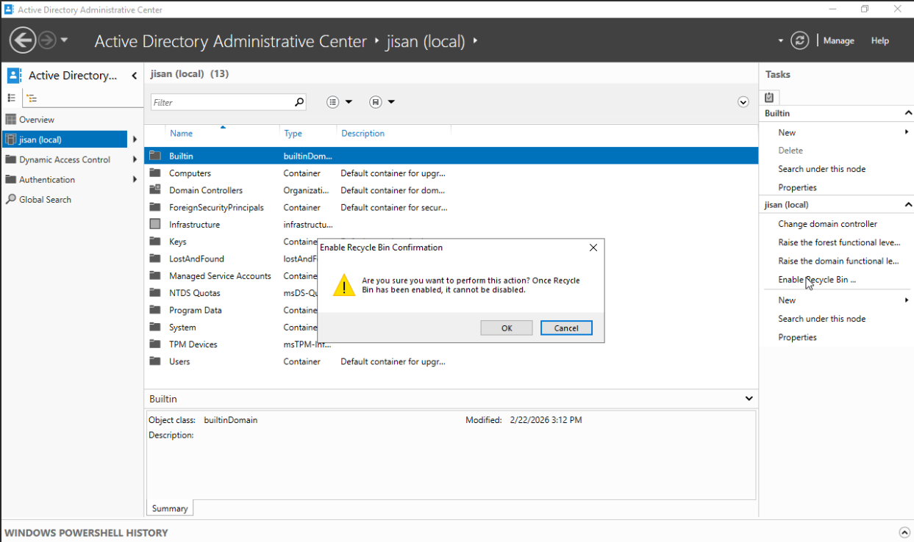
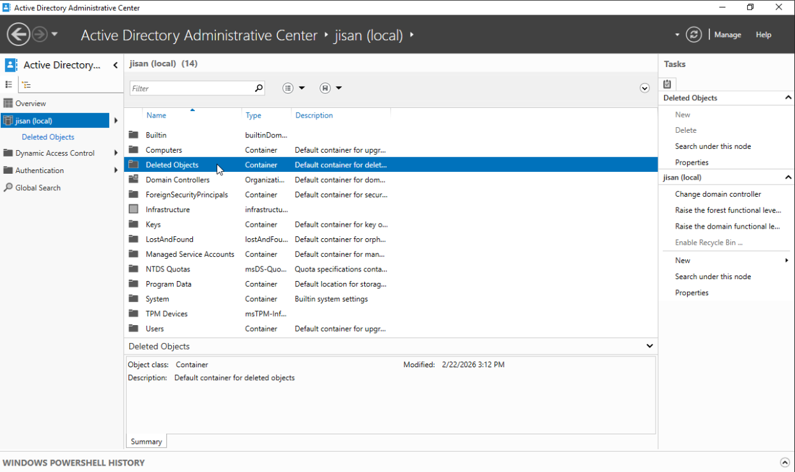

# Common Problems with their Solution.

## Can't find User??

1. Right click **Domain COntroller** (e.g. jisan.local)
2. **Find**
3. **In : Entire Directory**

## User forget the password

1. Open **Active Directory Users & COmputers** -> **Users**
2. **Account** -> Untick the **Unlock the account**

## Reset the Password

1. Open **Active Directory Users & Computers** -> **Users**
2. **Left click the User** -> **Reset Password**
3. Tick the box -> **User must change pass at next logon**

## Disable the account

1. Open **Active Directory Users & Computers** -> **Users**
2. **Left click the User** -> **Disable Account**

## Enable the recycle bin

1. Open **Active directory admin center**
2. click your domain.
3. at the very right panel, you will see **Enable recycle bin**
    > 📸 **Screenshot:** 
       
4. reload, and wait for a moment. A **Container** named **Deleted Object** will appear.
    > 📸 **Screenshot:** 
       

## Delete User. Note: Never delete a user, unless you are told by higher officials.

1. Open **Active Directory Users & Computers** -> **Users**
2. **Left click the User** -> **Delete**

