# Building a Windows Server 2022 Domain Controller & Windows 10 Client 

## Overview
This documentation covers the step-by-step process of provisioning, installing, and configuring a Windows Server 2022 Domain Controller (DC) and a Windows 10 client within a Proxmox Virtual Environment. It includes the configuration of Active Directory (AD DS), DNS, DHCP, and Group Policy Objects (GPO) for automated network drive mapping.

---

## Prerequisites
Before starting, ensure you have the following resources available in your Proxmox ISO storage:
* **Windows Server 2022 ISO** (180-day evaluation available from Microsoft)
* **Windows 10 ISO** * **VirtIO Drivers ISO** (Required for Proxmox Windows virtualization)
> 📸 **Screenshot:** 
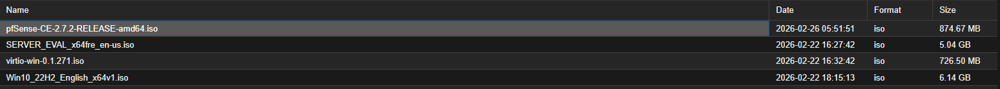

---

## Part 1: Provisioning the Windows Server 2022 VM

1. Log into your Proxmox web interface and click **Create VM**.
2. **General:** Assign a VM ID  and Name the VM `DC`.
3. **OS:** Select your Windows Server 2022 ISO. Change the Guest OS Type to **Microsoft Windows**.
4. **System:** Enable **Add TPM** and **Add EFI Disk**. Select your target storage for both.
5. **Disks:** Change the Bus/Device to **SCSI**. Select your storage pool  and set the Disk size to **64 GB**.
6. **CPU & Memory:** Allocate **2 Cores** and **4096 MB (4GB)** of RAM.
7. **Network:** Assign the interface to your lab bridge (e.g., `vmbr1`) and set the VLAN Tag (e.g., `20`).
8. **Add VirtIO Drivers:** Before starting the VM, go to the VM's **Hardware** tab, click **Add > CD/DVD Drive**, and mount the `virtio-win.iso`.

---

## Part 2: Installing Windows Server 2022

1. Start the `DC` VM and open the Console. Press any key to boot from the CD.
2. Click **Install Now**.
3. **Crucial Step:** Select **Windows Server 2022 Standard Evaluation (Desktop Experience)**.
4. Accept the licensing terms and choose **Custom: Install Windows only (advanced)**.
5. **Load Storage Drivers:**
   * You will notice no drives are found. Click **Load driver** -> **Browse**.
   * Navigate to the VirtIO CD drive -> `vioscsi` -> `w2k22` -> `amd64`.
   * Click **OK** and select the **Red Hat Virtual SCSI pass-through controller**.
6. Select the drive, click Next, and allow the installation to complete. Set a secure Administrator password upon reboot.

---

## Part 3: Initial Network & System Configuration

### Allow ICMP (Ping)
1. Open **Windows Defender Firewall with Advanced Security**.
2. Click **Inbound Rules** -> **New Rule...**
3. Select **Custom** -> **All Programs** -> Protocol type: **ICMPv4**.
4. Allow the connection, apply to all profiles, name it `Allow ICMPv4`, and click Finish.
   > 📸 **Screenshot:** The completed Inbound Rule wizard showing the ICMPv4 protocol selection.

### Static IP Assignment
1. Open **Network Connections** (`ncpa.cpl`).
2. Right-click your Ethernet adapter -> **Properties** -> **Internet Protocol Version 4 (TCP/IPv4)**.
3. Configure the static IP details for your VLAN (e.g., IP: `10.10.20.10`, Gateway: `10.10.20.254`, DNS: `8.8.8.8`).
   > 📸 **Screenshot:** 
   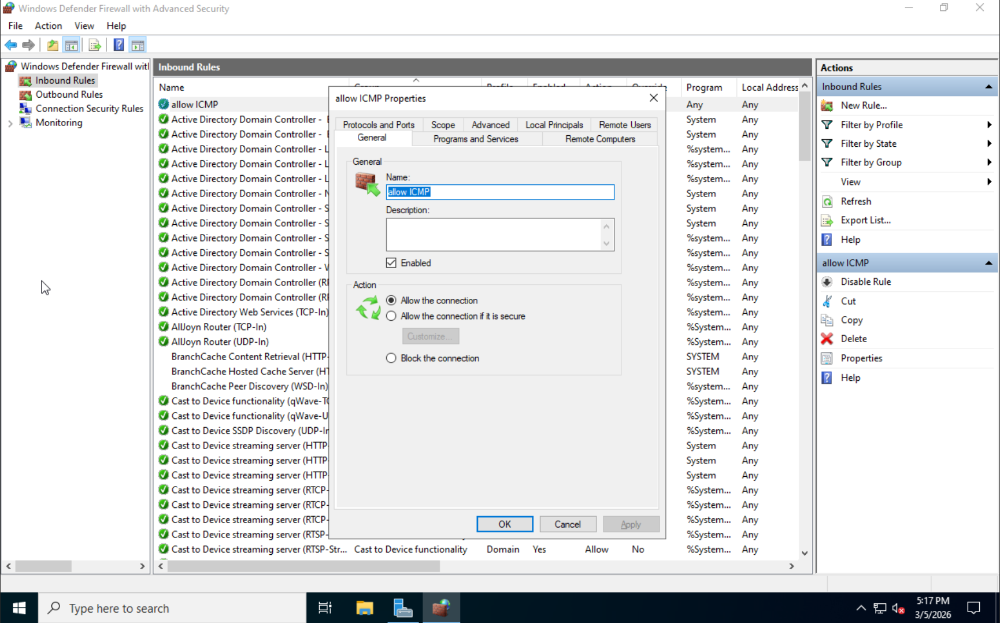

### Rename Server
1. Right-click **This PC** -> **Properties** -> **Rename this PC (advanced)**.
2. Change the computer name to `DC` and restart the server.

---

## Part 4: Promoting to a Domain Controller

1. Open **Server Manager** and click **Add roles and features**.
2. Proceed to Server Roles and check the following:
   * **Active Directory Domain Services**
   * **DHCP Server**
   * **DNS Server**
   > 📸 **Screenshot:** 
   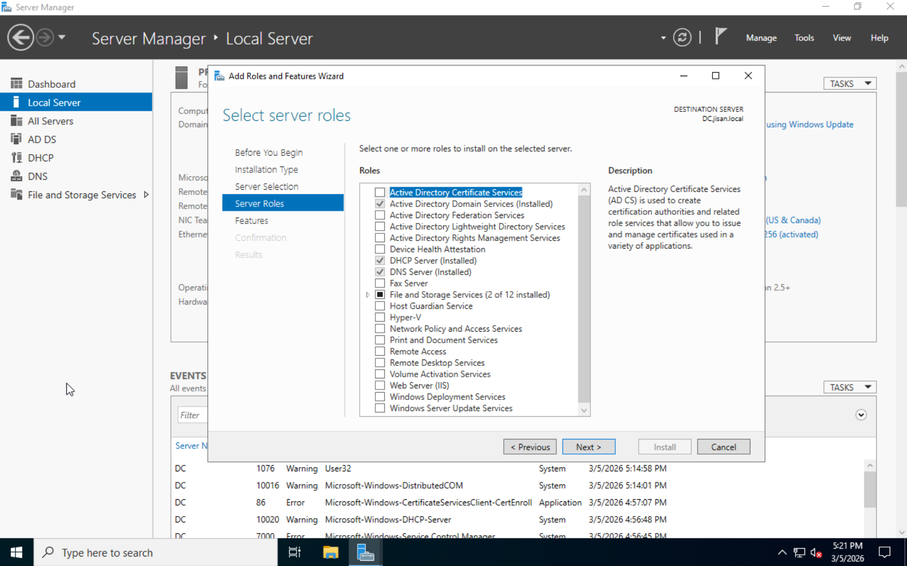
3. Complete the installation wizard. 
4. Once finished, click the **Flag icon** (Notifications) in Server Manager and select **Promote this server to a domain controller**.
   > 📸 **Screenshot:** 
      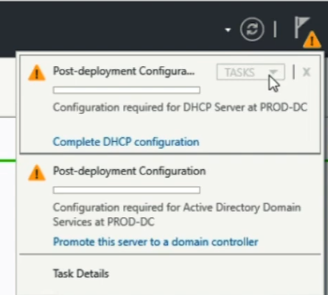
5. Select **Add a new forest** and enter your Root domain name (e.g., `jisan.local`).
   > 📸 **Screenshot:** 
      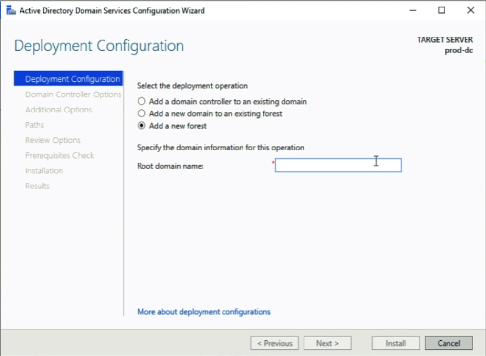

6. Enter a Directory Services Restore Mode (DSRM) password. Click Next through the defaults and click **Install**. The server will reboot automatically.

---

## Part 5: Basic Active Directory Setup ( OUs, Groups and Users)

This step establishes the hierarchy and logical grouping of your domain.

**1. Create Organizational Units (OUs)**
* Open **Active Directory Users and Computers** (ADUC) from the Windows Administrative Tools menu.
* Expand your forest. Right-click your domain name (e.g., `jisan.local`), hover over **New**, and select **Organizational Unit**.
* Name the OU based on geographical locations or major divisions (e.g., `BD`, `NZ`, `CA`) and click **OK**.
* Right-click the newly created `BD` OU, hover over **New**, and select **Organizational Unit** to create sub-OUs.
* Create three separate sub-OUs named `PCs`, `Users`, and `Servers`. Repeat this structure for the other geographical OUs.
> 📸 **Screenshot:** 
   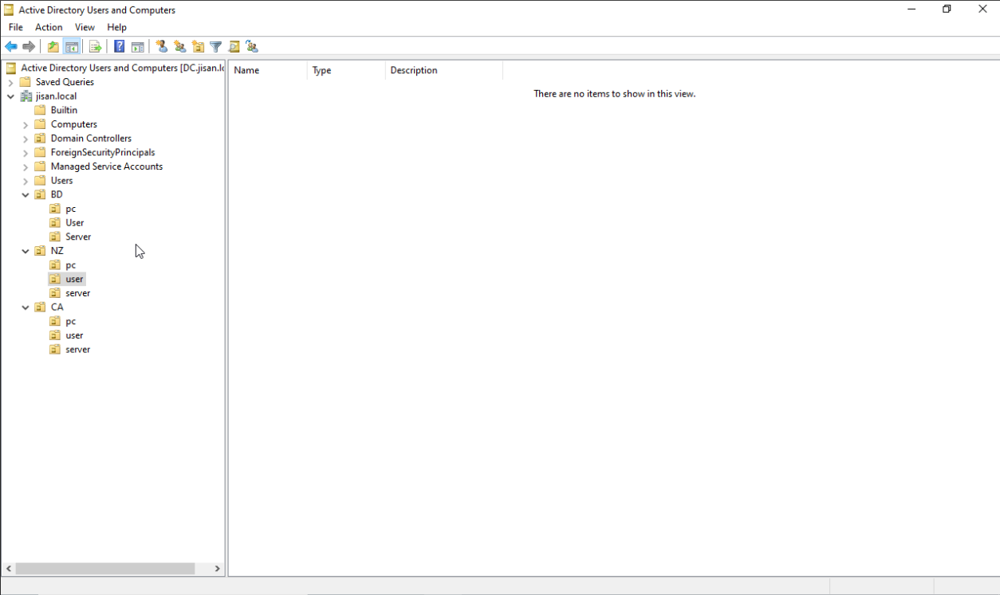

**2. Create Active Directory Groups**
* Navigate to your `BD` > `Users` OU.
* Right-click the empty space in the right-hand pane, hover over **New**, and select **Group**.
* Name the group based on a department (e.g., `IT` or `Finance`).
* In the New Object - Group window, you must select the Group Scope and Group Type. 
> 📸 **Screenshot:** 
   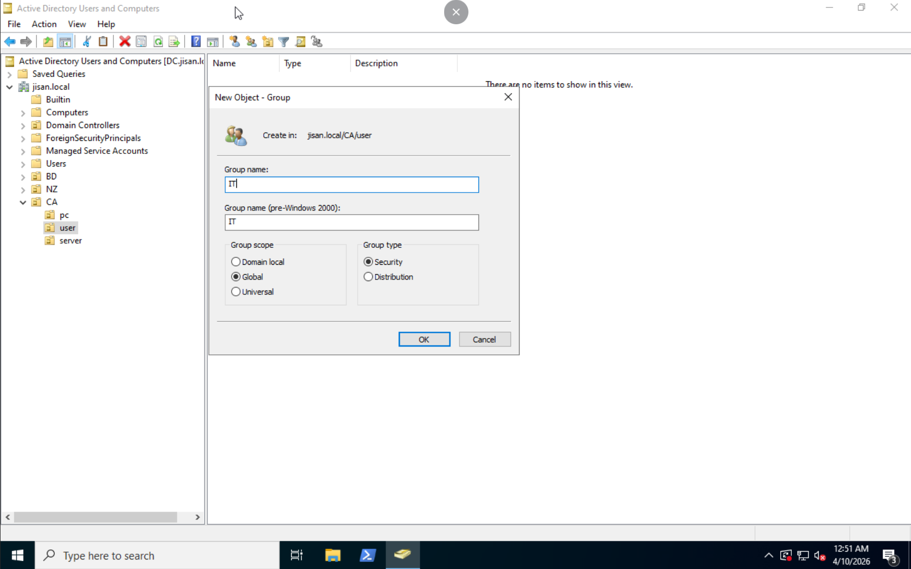

**Understanding Group Scopes**
* **Global:** The most typical choice. Used to grant permissions to objects within the *same* domain (e.g., assigning access to resources exclusively inside `EastCharmer.local`).
* **Universal:** Used to grant access across multiple different domains within a forest.
* **Domain local:** Used to manage permissions to resources strictly within the single domain where the group was created.

**Understanding Group Types**
* **Security Groups:** Utilized to assign permissions to shared resources and to assign specific user rights.
* **Built-in Security Groups:** Default groups already populated within Active Directory. The Domain Admins group grants full control to manage everything within the domain. The Remote Desktop Users group provides remote access to specific systems.
* **Custom Security Groups:** Manually created to fit the departmental structure of your company (e.g., a custom security group specifically for the Finance department to grant them the rights required to run financial data applications).
* **Security Group Permissions:** Dictates the exact level of interaction a user has with shared files, folders, and resources (e.g., full control, modify, or read-only access).
> 📸 **Screenshot:** 
   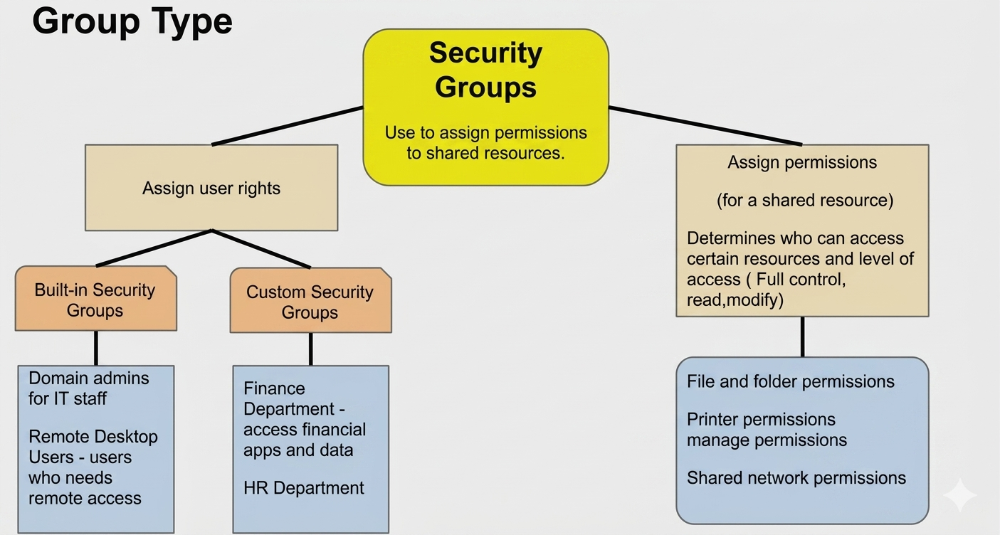
* **Distribution Groups:** Strictly for email communication and cannot be used to assign network permissions or user rights.
* **Distribution Group Uses:** Used to create email distribution lists for company-wide messages (All Employees), department-based lists (HR Department), or role-based lists (Managers).
> 📸 **Screenshot:** 
   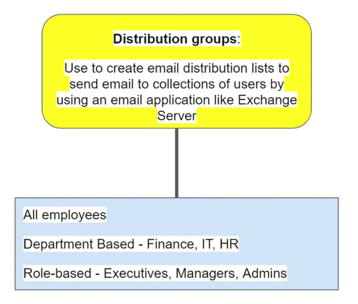

**Finalizing Group Creation**
* Select **Global** for the scope and **Security** for the type.
* Click **OK**.

> 📸 **Screenshot:** 
   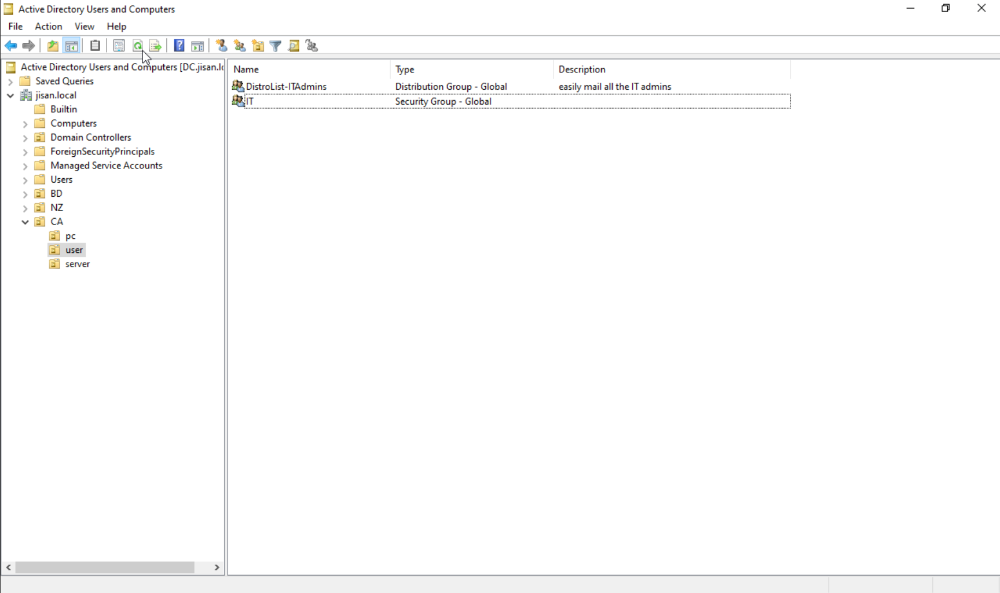

**3. Create User Accounts**
* Right-click the `BD` > `Users` OU, hover over **New**, and select **User**.
* Fill in the **First name**, **Last name**, and **User logon name** (e.g., `jk`). Click **Next**.
* Enter and confirm a temporary password.
* For a production environment, leave **User must change password at next logon** checked.
* For this specific home lab practice, uncheck it and check **Password never expires** to prevent account lockouts during testing.
* Click **Next**, review the summary, and click **Finish**.

> 📸 **Screenshot:** 
   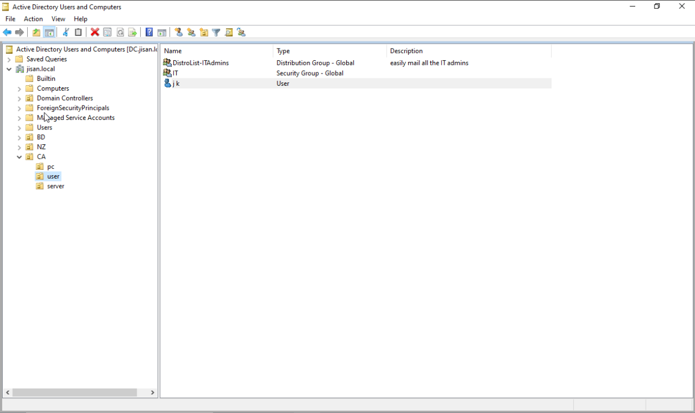

**4. Assign Users to Groups**
* Right-click the newly created user account and select **Properties**.
* Navigate to the **Member Of** tab.
* Click the **Add...** button.
* Type the name of the Security Group you created earlier (e.g., `IT`).
* Click the **Check Names** button. The group name should become underlined.
* Click **OK** on the selection window, and then click **OK** on the User Properties window to apply the changes.
5. Create an admin user (e.g., `jjadmin`).
6. Right-click the admin user -> **Properties** -> **Member Of** tab -> **Add**. Type `Domain Admins` and apply.
> 📸 **Screenshot:** 
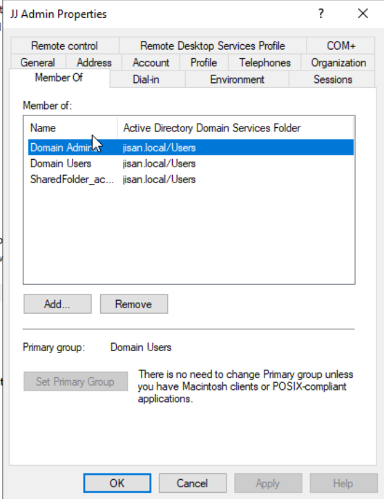
7. Add both users to the `Shared Folder Access` group.
> 📸 **Screenshot:** 
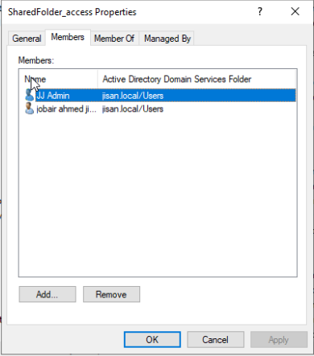 

---

## Part 6: Migrating DHCP Services

*(Note: If DHCP was previously handled by a firewall like pfSense, disable it on the firewall for this VLAN first).*

1. Open the **DHCP** management console from Server Manager tools.
2. Expand your server, right-click **IPv4**, and select **New Scope**.
3. Name the scope (e.g., `VLAN 20`).
4. Set the IP range (e.g., Start: `10.0.20.100`, End: `10.0.20.120`) and Subnet mask (`255.255.255.0`).
5. In the DHCP Options screen, add your Router (Default Gateway) IP (e.g., `10.0.20.254`).
6. Finish the wizard. Go back to Server Manager, click the Flag icon, and select **Complete DHCP configuration** -> **Commit**.

---

## Part 7: Shared Folder & Group Policy (GPO) Mapping

### Create the Share Folder
1. Open File Explorer and create a folder at `C:\SharedFolder`.

2. Right-click the folder -> **Properties** -> **Sharing** -> **Advanced Sharing**.

3. Check **Share this folder**, click **Permissions**, and grant Everyone **Full Control** (for lab purposes only).
   > 📸 **Screenshot:** 
   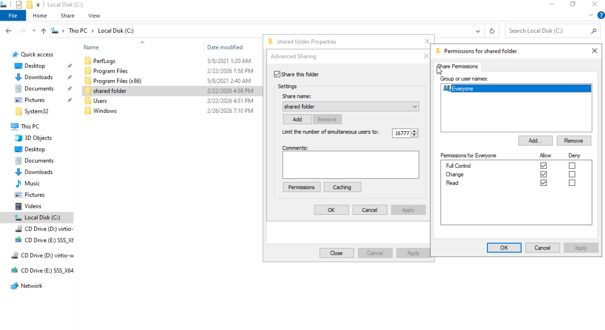

### Create the Group Policy
1. Open **Group Policy Management** (`gpmc.msc`).

2. Expand the forest and domain. Right-click your domain (`jisan.local`) and select **Create a GPO in this domain, and Link it here...** Name it `MapNetworkDrive`.
   > 📸 **Screenshot:** 
   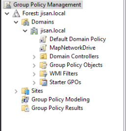
3. Right-click the new policy and click **Edit**.

4. Navigate to **User Configuration** -> **Preferences** -> **Windows Settings** -> **Drive Maps**.

5. Right-click the empty space -> **New** -> **Mapped Drive**.

6. **General Tab:**
   * Action: **Update**
   * Location: `\\DC\SharedFolder`
   * Label as: `SharedFolder`
   * Drive Letter: Use `G`

7. **Common Tab:**
   * Check **Run in logged-on user's security context**.
   * Check **Item-level targeting** and click **Targeting...**
   * Click **New Item** -> **Security Group**. Browse and select the `Shared Folder Access` group.
> 📸 **Screenshot:** The Targeting Editor window showing the Security Group configuration.
8. Click OK and apply the policy.

### Add the users to security group
1. Open **Active Directory Users and Computers** , select **Users**
2. Select which users you need in the group you just created
3. **User** -> **Memeber of** -> **Add** -> enter the group in the object name searchbox.
4. Apply -> Okay.

---

## Part 7.2: Advanced(1) Shared Folder & Group Policy (GPO) Mapping

**Computer Configuration vs. User Configuration:**
* **Computer Configuration:** These settings apply directly to the local computer hardware, regardless of who is logging into it. You use this when you want a policy to affect the machine itself (e.g., enforcing a company-wide password policy or disabling USB storage drives on specific desktop computers).
* **User Configuration:** These settings apply directly to the user account. The policies follow the user to whichever machine they log into on the domain. You use this for user-specific experience settings (e.g., mapping a specific department's network drive, setting a default desktop wallpaper, or hiding the Control Panel from standard employees).

**Policies vs. Preferences:**
* **Policies:** These are strict rules enforced by the IT Administrator. **Users cannot change, modify, or override these settings.** Policies are used for mandatory security and compliance measures (e.g., restricting Control Panel access, enforcing minimum password lengths, or account lockout thresholds).
* **Preferences:** These are default settings provisioned by the IT Administrator, but **users are allowed to modify them later.** Preferences are used to set up a convenient baseline without locking the user out of making changes (e.g., providing a default set of mapped network drives that a user can later add to or remove, or setting up default desktop shortcuts).

### Installing GPMC
1. Open **Server Manager**.
2. Go to **Manage** and select **Add roles and features**.
3. Select **Role-based or feature-based installation** and choose your server.
4. Skip the Server Roles section by clicking **Next**.
5. In the Features section, check the box for **Group Policy Management**.
6. Click **Next** and then **Install**.

### Activity 1: Password Policy GPO
1. Open **Group Policy Management** from the Windows Administrative Tools menu.
2. Expand your Forest and Domain tree. Right-click your specific domain(e.g., `jisan.local`) and select **Create a GPO in this domain, and Link it here...**
3. Name the new GPO `Password Policy` and click **OK**.
4. Right-click the newly created `Password Policy` GPO and select **Edit**.
5. Navigate the left pane to **Computer Configuration** > **Policies** > **Windows Settings** > **Security Settings** > **Account Policies** > **Password Policy**.
6. Double-click **Minimum password length**, check **Define this policy setting**, set the value to `12 characters`, and click **Apply**.
7. Double-click **Password must meet complexity requirements**, check **Define this policy setting**, set it to **Enabled**, and click **Apply**.
8. Double-click **Maximum password age**, check **Define this policy setting**, set the value to `90 days`, and click **Apply**.
> 📸 **Screenshot:** 
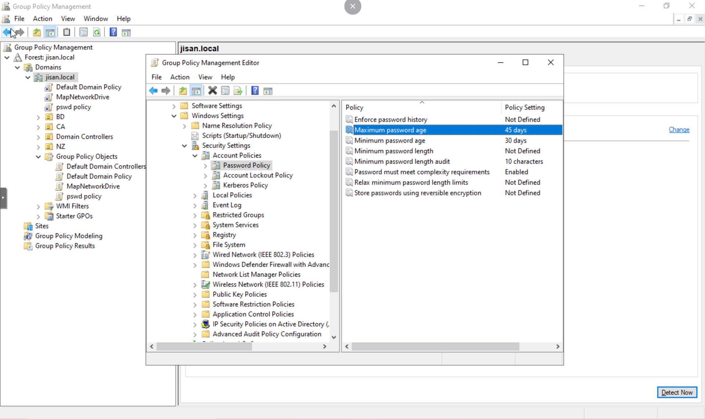

### Activity 2: Drive Mapping GPO
1. Create another new GPO on the domain named `Drive Mapping`. Right-click it and select **Edit**.
2. Navigate the left pane to **User Configuration** > **Preferences** > **Windows Settings** > **Drive Maps**.
3. Right-click **Drive Maps**, hover over **New**, and select **Mapped Drive**.
4. In the Location field, enter the UNC network share path (e.g., `\\servername\shared`).
5. Choose a Drive Letter from the dropdown (e.g., `S`), click **Apply**, and then click **OK**.
> 📸 **Screenshot:** 
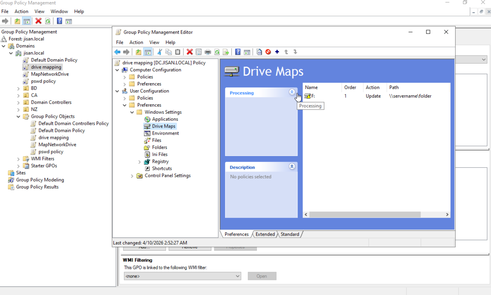

### Activity 3: Desktop Wallpaper GPO
1. Create a new GPO named `Desktop Wallpaper` and select **Edit**.
2. Navigate to **User Configuration** > **Policies** > **Administrative Templates** > **Desktop** > **Desktop**.
3. Double-click the **Desktop Wallpaper** setting.
4. Select the **Enabled** radio button.
5. Enter the UNC network path to the shared wallpaper image file.
6. Set the Wallpaper Style to **Fill** using the dropdown menu.
7. Click **Apply** and then **OK**.
> 📸 **Screenshot:** 
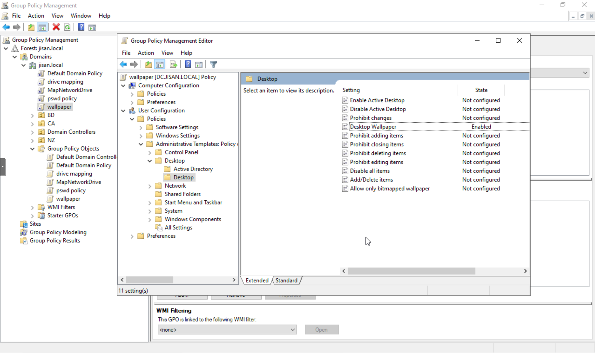

### Activity 4: Restrict Control Panel Access
1. Create a new GPO named `Restrict Control Panel` and select **Edit**.
2. Navigate to **User Configuration** > **Policies** > **Administrative Templates** > **Control Panel**.
3. Double-click the **Prohibit access to Control Panel and PC settings** policy.
4. Select the **Enabled** radio button, click **Apply**, and then click **OK**.
> 📸 **Screenshot:** 
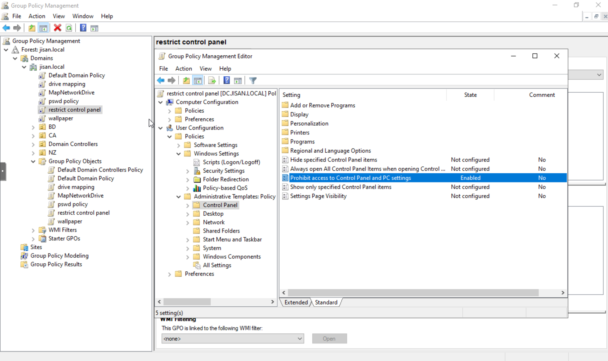

### Activity 5: Disable USB Storage
1. Create a new GPO named `Disable USB Devices` and select **Edit**.
2. Navigate to **Computer Configuration** > **Policies** > **Administrative Templates** > **System** > **Removable Storage Access**.
3. Double-click the **All Removable Storage classes: Deny all access** policy.
4. Select the **Enabled** radio button, click **Apply**, and then click **OK**.
> 📸 **Screenshot:** 
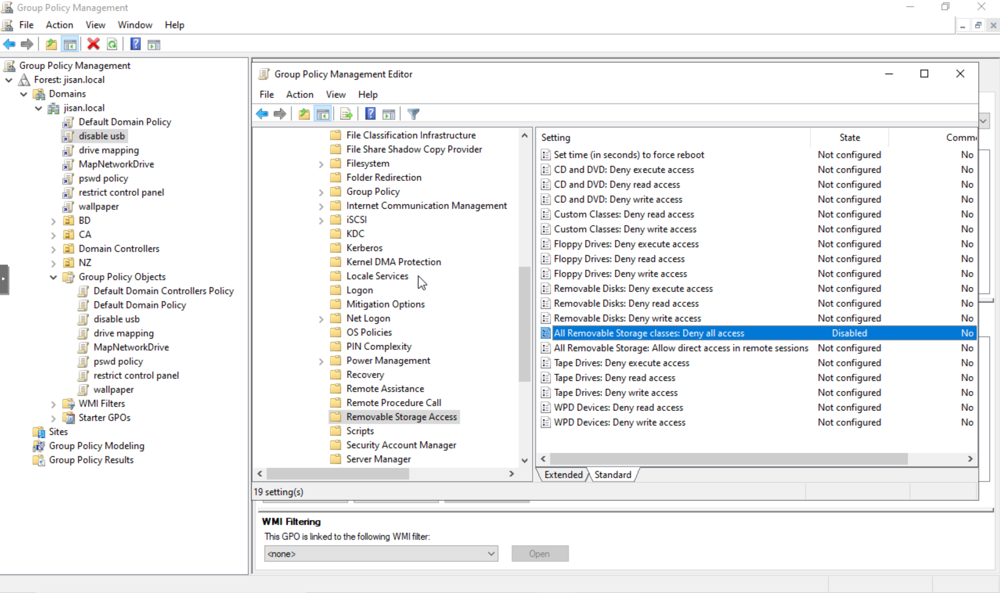

---

## Part 7.3: Applying and Testing GPOs & Domain Join

### Organizing AD and Applying GPOs
1. On the Server, open **Active Directory Users and Computers** (ADUC).
2. Click on the default **Computers** container. Right-click the newly joined client computer object and select **Move**.
3. Select the appropriate organizational unit (e.g., the `USA` > `Computers` OU) and click **OK**.
4. Open the **Group Policy Management** console.
5. Drag and drop the `Restrict Control Panel` and `Drive Mapping` GPOs from the Group Policy Objects container onto the `Users` OU to link them.
6. Drag and drop the `Disable USB Devices` and `Password Policy` GPOs onto the `Computers` OU to link them.

### Testing the Implementation
1. Log into the client machine using one of the domain user accounts you created earlier.
2. Open Command Prompt and run `gpupdate /force` to immediately pull and apply the latest Group Policy changes.
3. Attempt to open the Control Panel from the Start Menu. An error message should appear stating the operation has been cancelled due to restrictions.
> 📸 **Screenshot:** 
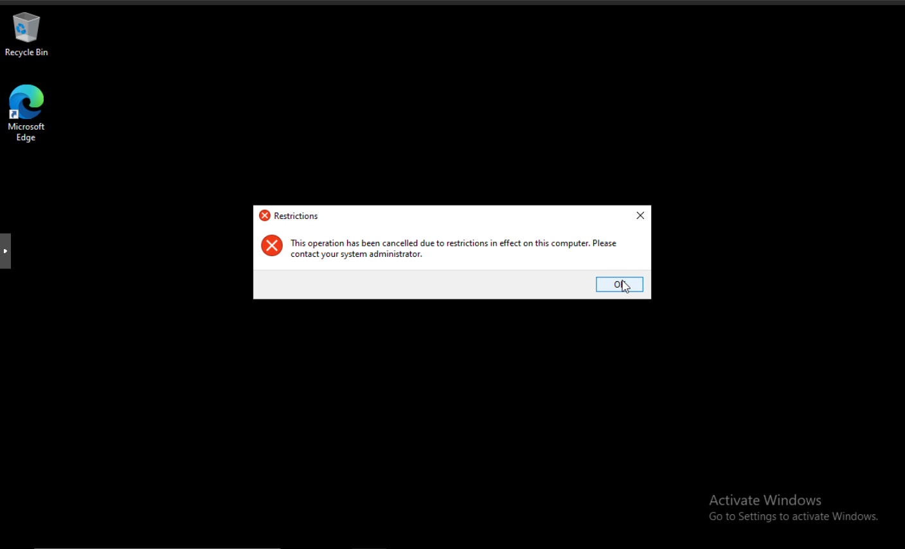

---

## Part 7.4: Implementing Advanced Security Policies

### Account Lockout Policy
1. Open the **Group Policy Management** console.
2. Expand your domain, right-click the **Default Domain Policy**, and select **Edit**.
3. Navigate to **Computer Configuration** > **Policies** > **Windows Settings** > **Security Settings** > **Account Policies** > **Account Lockout Policy**.
4. Double-click **Account lockout duration**, check the box to define the setting, and set it to `30 minutes`.
5. Double-click **Account lockout threshold**, check the box to define the setting, set it to `3 invalid logon attempts`, and apply the changes.
> 📸 **Screenshot:** 
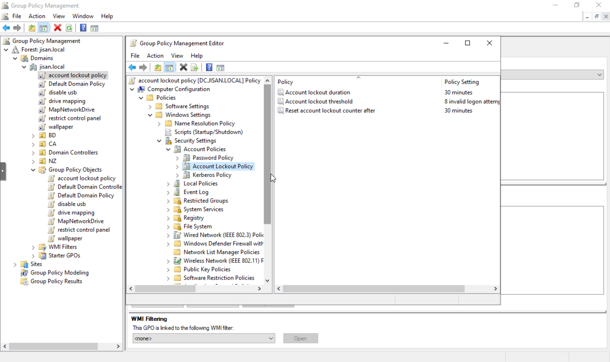

### Fine-Grained Password Policies
1. Open the **Active Directory Administrative Center** (ADAC) from the Windows Administrative Tools menu.
2. Navigate the left pane to your domain name, select **System**, and click on the **Password Settings Container**.
3. Right-click the empty space, hover over **New**, and select **Password Settings**.
4. Create the Admin Policy by naming it (e.g., `Admin_Password_Policy`) and setting the **Precedence** value to `1` (highest priority).
5. Set the minimum password length to `15` and check the box for **Enforce password history**.
6. Scroll down to the "Directly Applies To" section, click **Add**, select your IT Admins group, and click **OK**.
7. Repeat steps 3 through 6 to create a standard user policy with a Precedence of `2` and less strict password requirements applied to standard user groups.
> 📸 **Screenshot:** 
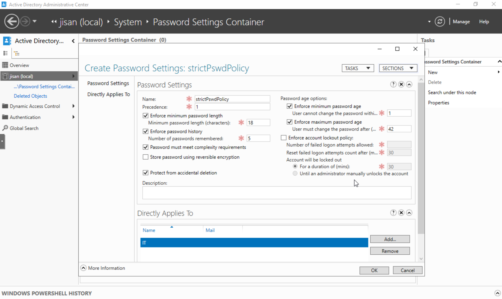

---

## Part 7.5: Setting up Network Sharing and File Services
### Quick comparison:
> 📸 **Screenshot: Shared: Folder Level, NTFS: File and Folder Level** 
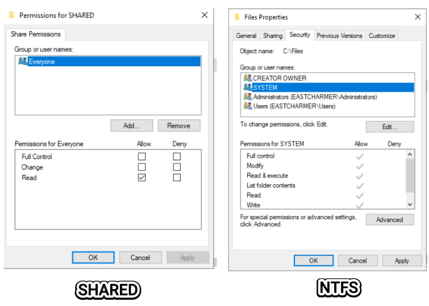

### Activity 1: Configure File Sharing and Permissions
1. On the Windows Server, open **File Explorer** and navigate to the local `C:\` drive.
2. Right-click in the empty space, select **New**, and create a folder named `Shared`.
3. Right-click the `Shared` folder and select **Properties**.
4. **Configure Share Permissions:**
   * Go to the **Sharing** tab and click **Advanced Sharing**.
   * Check the box for **Share this folder**.
   * Click the **Permissions** button.
   * Click **Add**, type `Domain Users`, click **Check Names**, and click **OK**.
   * With `Domain Users` selected, ensure the **Read** permission is checked under the Allow column. Click **Apply** and **OK**.
5. **Configure NTFS Permissions:**
   * Go to the **Security** tab in the folder properties.
   * Click **Edit**, click **Add**, type `Domain Users`, and click **OK**.
   * Ensure standard read/execute permissions are applied. Click **Apply** and **OK** to close the properties window.
> 📸 **Screenshot:The "Advanced Sharing" permissions window showing Domain Users with Read access.**
> 

### Activity 2: Test Network Share and Manual Drive Mapping
1. Log into your Windows client VM using a standard domain user account.
2. Open **File Explorer**, right-click **This PC**, and select **Map network drive**.
3. Select a drive letter from the dropdown (e.g., `S` for Shared).
4. In the Folder field, type the UNC path to your share: `\\<YourServerName>\Shared` (If you do not know your server name, open Command Prompt on your server and type `hostname`).
5. Uncheck **Reconnect at sign-in** for this test. Click **Finish**.
6. Verify the shared folder opens and is visible under "This PC". 
7. Restart the client computer. Notice that the manually mapped drive disappears after the reboot because it was not persistent.
> 📸 **Screenshot: File Explorer on the client machine showing the successfully mapped "Shared" drive under Network locations.**
>

### Activity 3: Configure a GPO to Automatically Map Network Drives
*Configuration Type: User | Setting Type: Preference*
1. On the Windows Server, open the **Group Policy Management** console.
2. Right-click the Group Policy Objects container, select **New**, and name the GPO `Map Drives`.
3. Right-click the new `Map Drives` GPO and select **Edit**.
4. Navigate to **User Configuration** > **Preferences** > **Windows Settings** > **Drive Maps**.
5. Right-click **Drive Maps**, hover over **New**, and select **Mapped Drive**.
6. In the Location field, enter the exact network path: `\\<YourServerName>\Shared`.
7. Type `Shared` in the **Label as** field.
8. Choose the drive letter `S` from the **Use** dropdown menu. Click **Apply** and **OK**.
9. Close the editor. In GPMC, drag and drop the `Map Drives` GPO onto your **Users** OU to link it.
10. Test on the client machine by running `gpupdate /force` in Command Prompt, rebooting, and verifying the drive maps automatically upon login.
> 📸 **Screenshot: "New Drive Map Properties" window inside the Group Policy Management Editor showing the configured location, label, and drive letter.**
>

### Activity 4: Install File Server Resource Manager (FSRM)
1. Open **Server Manager**, click **Manage**, and select **Add roles and features**.
2. Proceed to the **Server Roles** section.
3. Expand **File and Storage Services**, then expand **File and iSCSI Services**.
4. Check the box for **File Server Resource Manager**.
5. Click **Add Features** when prompted, then click **Next** through the remaining screens and click **Install**.

### Activity 5: Implement Quotas and File Screening
1. Open **File Server Resource Manager** from the Windows Administrative Tools menu.
2. **Configure a Quota:**
   * Expand **Quota Management**, right-click **Quotas**, and select **Create Quota**.
   * Under Quota path, browse to and select your `C:\Shared` folder.
   * Select the **Define custom quota properties** radio button and click **Custom Properties**.
   * Set the **Space limit** (e.g., `10 GB`).
   * Add a Notification threshold (e.g., Generate a warning at 80% capacity to notify IT admins). Click **OK** and **Create**.
3. **Configure a File Screen:**
   * Expand **File Screening Management**, right-click **File Screens**, and select **Create File Screen**.
   * Set the File screen path to your `C:\Shared` folder.
   * Select the **Define custom file screen properties** radio button and click **Custom Properties**.
   * Select the file groups you want to block users from saving to the server (e.g., check Audio and Video Files, Executable Files, and Image Files to restrict the folder to documents only).
   * Click **OK** and **Create**. Save the custom template with a recognizable name (e.g., `Shared_Screen`) when prompted.
<!-- > *[Insert Screenshot: The "Create File Screen" custom properties window showing the selected file groups being blocked (Audio, Video, Executables).]* -->

---

## Part 7.6: NTFS vs. Shared Folder Permissions

**Key Rules:**
* **Share permissions** apply exclusively when a user accesses the folder over the network.
* **NTFS permissions** apply both locally and over the network.
* When both are configured and combined, the system will always enforce the **most restrictive** permission between the two.

### Activity 1: The "Upload-Only" Access
1. Create a folder named `HRs` on the server's local drive.
2. Right-click the folder, select **Properties**, go to the **Sharing** tab, and click **Advanced Sharing**.
3. Check the box to **Share this folder**, click **Permissions**, add the `HRs` group, and check the box to grant them **Full Control** share permissions. Click **OK**.
4. Go to the **Security** tab (NTFS permissions) and click **Edit**.
5. Click **Add**, type the `HRs` group, and click **OK**.
6. With the `HRs` group selected, uncheck all allowed permissions except for **Write**. Click **Apply** and **OK**.
7. *Result:* Vendors can drop files into the network share, but the restrictive NTFS rule prevents them from opening, reading, or viewing existing files in the folder.
> 📸 **Screenshot: The Security tab permissions window showing the Vendors group with only the "Write" permission checked.**
> 

### Activity 2: Disabling Inheritance for Exclusive Subfolder Access
1. Locate a subfolder named `Licenses` residing inside a parent folder that is shared with the entire IT department.
2. Right-click the `Licenses` subfolder, select **Properties**, navigate to the **Security** tab, and click **Advanced**.
3. Click the **Disable inheritance** button near the bottom.
4. When prompted, select the option to **Remove all inherited permissions from this object**. This strips all previous IT department access from the folder.
5. Click **Add**, click **Select a principal**, and type the name of your `Senior IT` group.
6. Grant the `Senior IT` group **Full Control** and click **OK** to apply the changes.

---

## Part 7.7: Advanced Effective Permissions and Inheritance

### Activity 1: Converting Inherited Permissions
1. Right-click a target subfolder (e.g., a subfolder named `Project` inside a common company share), select **Properties**, go to the **Security** tab, and click **Advanced**.
2. Click the **Disable inheritance** button.
3. Select the option to **Convert inherited permissions into explicit permissions on this object**. This retains the current list of permissions but breaks the active link to the parent folder.
4. In the permission entries list, select the `Everyone` group and click **Remove**.
5. Click **Add**, choose **Select a principal**, and type the `Project Team` group.
6. Grant the `Project Team` group **Modify** or **Full Control** access, click **OK**, and apply all changes.

### Activity 2: Applying an Explicit Deny
1. Locate a sensitive subfolder (e.g., `Confidential`) within a general employee share.
2. Right-click the subfolder, select **Properties**, go to the **Security** tab, and click **Edit**.
3. Click **Add**, type a specific user's name (e.g., `John Doe`), and click **OK**.
4. Select `John Doe` from the list. Under the **Deny** column, check the box for **Read** (or **Full Control** to block everything).
5. Click **Apply**.
6. A Windows Security warning will appear stating that Explicit Deny rules override Allow rules. Click **Yes** to proceed.

---

## Part 8: Building and Joining the Windows 10 Client

1. Create a new Proxmox VM (e.g., `prod-win10`) following the exact same hardware steps as the Windows Server (SCSI, 64GB, VLAN 20, add VirtIO CD-ROM).
2. Start the VM and boot into the Windows 10 setup.
3. Choose **Custom: Install Windows only (advanced)**.
4. Click **Load driver** -> **Browse** -> Navigate to the VirtIO CD -> `vioscsi` -> `w10` -> `amd64`. Load the driver and install Windows 10.
5. During the out-of-box experience (OOBE), select **Domain join instead** (bottom left corner) to skip the Microsoft Account login.
6. Once on the desktop, open Command Prompt and run `ipconfig`. Verify the machine received an IP address from your newly configured DHCP scope (e.g., `10.10.20.100`).
7. Open **System Properties** (`sysdm.cpl`).
8. Click **Change...**, select **Domain**, and type `jisan.local`. 
9. When prompted, authenticate using the `jjadmin` domain account.
10. Restart the PC.
11. At the login screen, choose **Other User** and log in with the standard user account created earlier (e.g., `jisan\jjisan`).
12. Open File Explorer and verify that the `G:` drive has mapped automatically via Group Policy.
   > 📸 **Screenshot:** 
   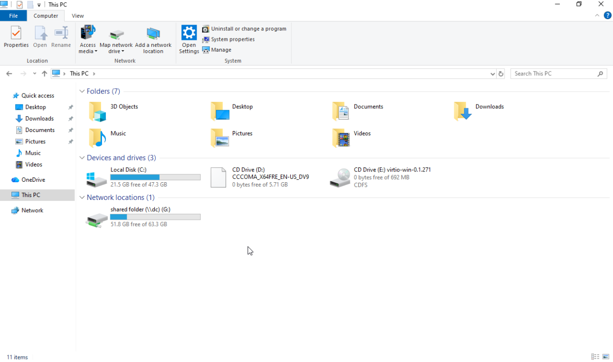

---
